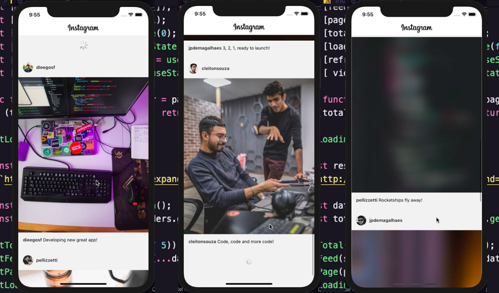

<p align="center">
  
</p>

# Instaclone - React Native

> Desenvolvimento do **Clonde do Instagram**, simulando o Instagram

### 📄 O que foi usado:

- React
- React-Native
- Styled Components
- Prettier
- Hooks
- LazyLoad
- Paginate

### 🎯 Funcionalidade:

> Navegação na tela do **instagram**.

> Paginação infinita

> LazyLoad das imagens

> onRefresh

### 🛠 Mão na massa:

> Você pode realizar o clone deste repositório ou baixar o arquivo .zip!

Clone o repositório:

````
git clone https://github.com/Lucaslimasz/clone-picpay-ReactNative.git
````

Para baixar o zip: https://github.com/Lucaslimasz/clone-picpay-ReactNative/archive/master.zip

### 💻 Executando o projeto 🚀

#### Na raiz do projeto, execute os comandos:

````
# Para instalar as dependências
yarn install

# Para startar o projeto utilize
yarn ios
````
